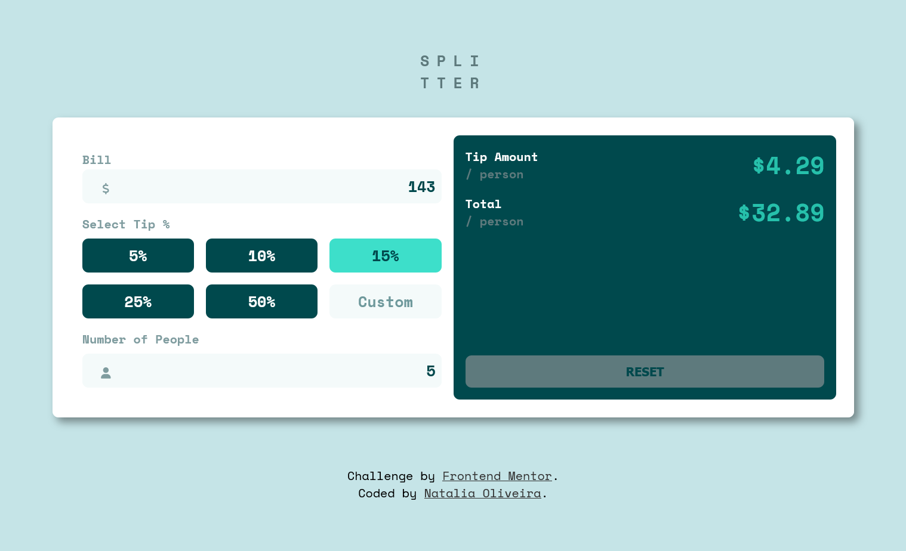

# Frontend Mentor - Tip calculator app solution

This is a solution to the [Tip calculator app challenge on Frontend Mentor](https://www.frontendmentor.io/challenges/tip-calculator-app-ugJNGbJUX).

## Table of contents

- [Overview](#overview)
  - [The challenge](#the-challenge)
  - [App Preview](#app-preview)
  - [Links](#links)
- [My process](#my-process)
  - [Built with](#built-with)
- [Author](#author)

## Overview

### The challenge

Users should be able to:

- View the optimal layout for the app depending on their device's screen size
- See hover states for all interactive elements on the page
- Calculate the correct tip and total cost of the bill per person

### App Preview

### Links

- Solution URL: [Frontendmentor](https://www.frontendmentor.io/solutions/functional-and-responsive-tip-calculator-MugQpv1zJf)
- Live Site URL: [GithubPages](https://noliv197.github.io/tip-calculator/)

## My process

Practice of native HTML, CSS and Javascript

### Built with

- Semantic HTML5 markup
- CSS custom properties
- Flexbox
- CSS Grid
- Desktop-first workflow

## Author

- Portfolio - [Natalia Oliveira](https://portfolio-zeta-rose-48.vercel.app)
- Linkedin - [Natalia Oliveira](https://www.linkedin.com/in/natália-m-oliveira/)
- Frontend Mentor - [@noliv197](https://www.frontendmentor.io/profile/noliv197)

